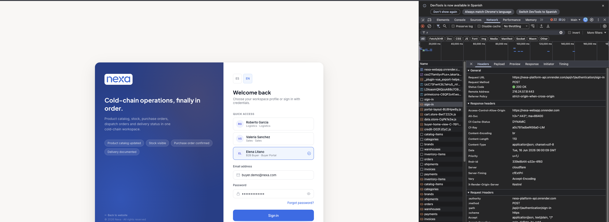
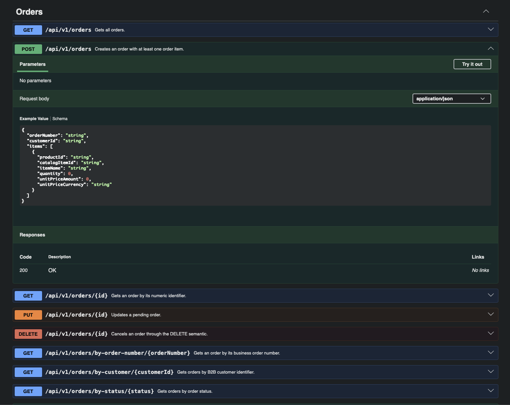
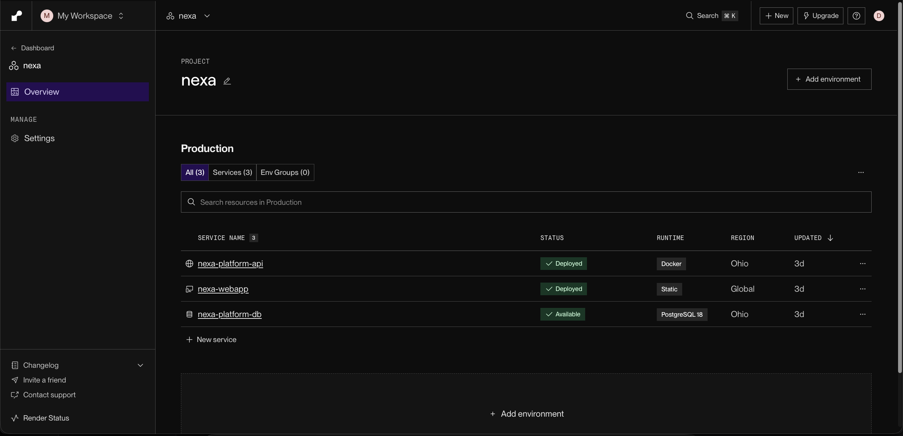
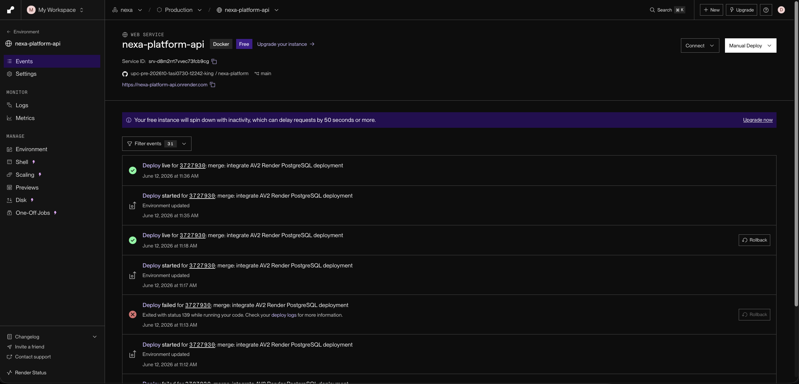
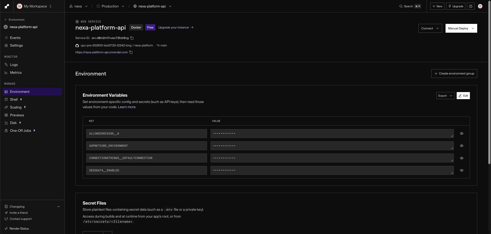
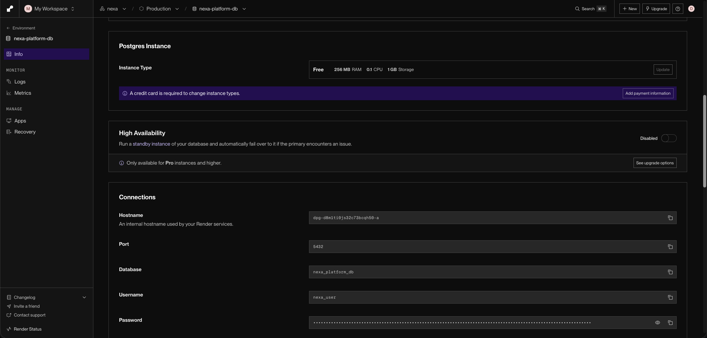
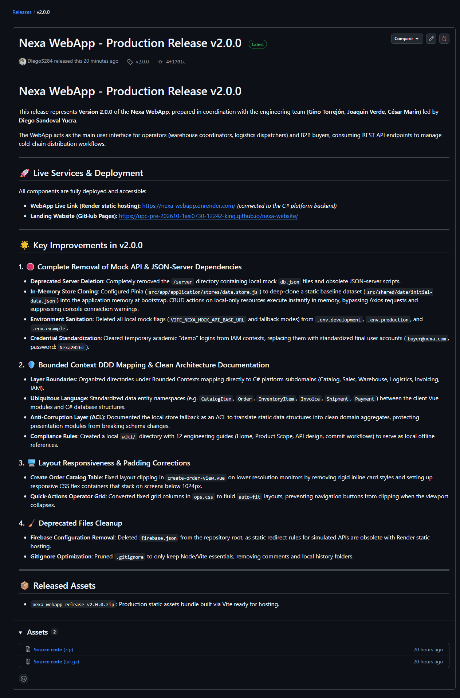
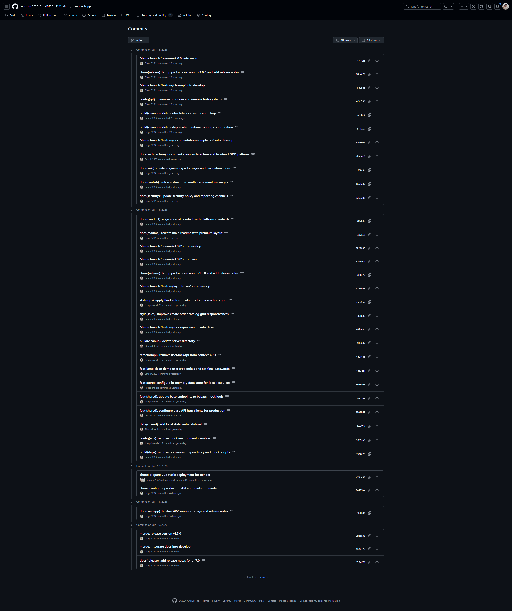
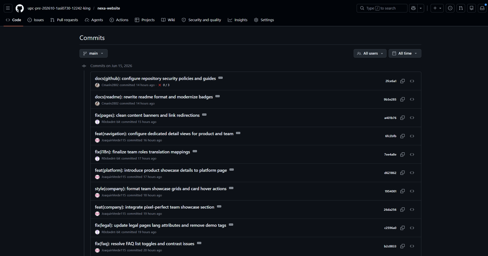
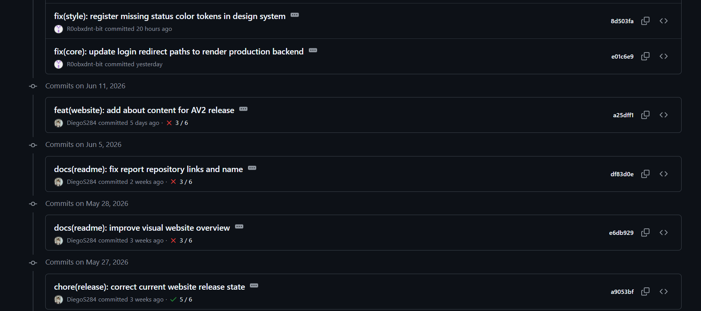

## 5.2.3. Sprint 3

El Sprint 3 corresponde al incremento **Backend Foundation Sprint** y al corte AV2 frontend/backend de Nexa. La evidencia de cierre técnico disponible registra `nexa-platform v1.0.0` como release de cierre AV2 de Web Services, `nexa-website v3.0.0` como release de cierre AV2 de Landing Page y `nexa-webapp v2.0.0` como release de cierre AV2 de Web Application. Este alcance marca una transición controlada desde servicios simulados hacia backend real, despliegue en Render y configuración/migración de persistencia hacia PostgreSQL, sin declarar todavía el cierre completo de evidencias no técnicas.

La versión de referencia disponible del backend para esta evidencia parcial es `v1.0.0`, construida con ASP.NET Core Web API, C#, .NET 10, Domain-Driven Design, modular monolith, bounded contexts, Shared Kernel, EF Core, PostgreSQL, controladores REST, commands, queries, infrastructure y ajustes de autenticación IAM alineados con la Web Application. Este incremento prioriza los flujos core de Catalog Management, Warehouse y Sales como base para revisión académica y validación controlada, sin declarar todavía operación productiva, integración total con toda la Web Application, reemplazo completo de todos los mocks ni cobertura total del roadmap backend.

### 5.2.3.1. Sprint Planning 3
La planificación del Sprint 3 organizó el avance AV2 por segmento, integrando la nueva versión de Landing Page, la nueva versión de Web Application y la primera versión de Web Services de Nexa Platform. El sprint priorizó una foundation backend defendible, organizada por bounded contexts, junto con evidencias de navegación, despliegue controlado en Render, PostgreSQL y documentación Swagger/OpenAPI para los flujos principales de S1, S2 y S3, sin declarar todavía operación productiva.

| Campo | Registro |
|---|---|
| Sprint # | Sprint 3 |
| **Sprint Planning Background** | Tercer incremento del proyecto orientado a consolidar la foundation backend de Nexa Platform con ASP.NET Core Web API, arquitectura modular por bounded contexts y recursos REST iniciales para Catalog Management, Sales y Warehouse, manteniendo trazabilidad con el cierre AV2 de Landing Page y Web Application. |
| Date | 2026-05-20 |
| Time | 08:00 PM |
| Location | Reunión virtual del equipo |
| Prepared By | Yucra Sandoval, Diego Sebastian |
| Attendees (to planning meeting) | Yucra Sandoval, Diego Sebastian / Verde Bueno, Joaquín / Marín Cueva, César / Rojas Mancilla, Gerard / Torrejón, Gino |
| Sprint 2 Review Summary | Sprint 2 dejó como base la Web Application TB1, los flujos internos S1/S2, el alcance parcial de S3 y el soporte de servicios simulados para validar recorridos frontend. |
| Sprint 2 Retrospective Summary | El equipo identificó la necesidad de separar con mayor claridad la simulación frontend de la API interna objetivo, reforzando la foundation backend y la trazabilidad técnica del repositorio `nexa-platform`. |
| **Sprint Goal & User Stories** |  |
| Sprint 3 Goal | Nuestro foco está en consolidar el incremento AV2 de Nexa mediante una primera foundation backend real, una WebApp actualizada y evidencias de despliegue que cubran los principales flujos B2B de coordinación comercial, operación interna y comprador. Creemos que esto entrega mayor trazabilidad para solicitudes y órdenes, mejor control de catálogo, inventario, reservas, despacho y autenticación, además de mayor autonomía para el comprador B2B al consultar productos, generar solicitudes, revisar estados, documentos y seguimiento desde la experiencia web. Esto se confirmará cuando la WebApp, la Platform API, Swagger/OpenAPI, PostgreSQL, Render, Jira y las capturas/video del Sprint Review demuestren los recursos REST priorizados de Catalog Management, Sales, Warehouse, IAM, Invoicing y Logistics junto con la navegación principal del cierre AV2. |
| Sprint 3 Velocity | 213 horas completadas |
| Sum of Hours | 213 horas |

> *Nota.* El dato se obtiene del Sprint Backlog 3 en Jira, donde la estimación visible del sprint registra `213 de 213`. Para mantener consistencia con la métrica solicitada para Sprint 3 y con la columna `Estimation (Hours)` del Sprint Backlog, el valor se expresa como `213 horas`.

Para evitar ambigüedad de alcance, se distingue entre endpoint HTTP, REST resource y core endpoint group o core flow. Un endpoint HTTP corresponde a una operación concreta expuesta por la API, por ejemplo una ruta con un método específico. Un REST resource agrupa operaciones asociadas a una entidad o aggregate, como `/api/v1/orders`. Un core endpoint group representa una capacidad funcional priorizada para validar conexión frontend/backend. Por ello, Catalog, Inventory/Warehouse y Orders/Sales se documentan como tres flujos core agrupados, mientras que el backend actual registra 25 operaciones HTTP estructuradas.

### 5.2.3.2. Aspect Leaders and Collaborators

La ejecución del Sprint 3 se organizó por bounded contexts, porque el incremento AV2 priorizó la primera versión de Web Services de `nexa-platform` y su separación modular. Por ello, la matriz de liderazgo y colaboración usa como columnas los contextos trabajados durante el sprint, en lugar de frentes genéricos como project management, architecture o documentation. La marca `L` identifica al responsable principal del contexto y la marca `C` identifica participación de soporte, integración o revisión técnica.

*Distribución de liderazgos y colaboradores por bounded context en el Sprint 3*

| Team Member | GitHub Username | Catalog Management | Sales | Warehouse | IAM | Invoicing | Logistics | Shared Kernel |
|---|---|:---:|:---:|:---:|:---:|:---:|:---:|:---:|
| Yucra Sandoval, Diego Sebastian | DiegoS284 | C | L | C | L | C | C | C |
| Verde Bueno, Joaquín Francisco | JoaquinVerde115 | C | C | L | C | C | C | C |
| Marín Cueva, César Fernando | Cmarin2802 | - | C | - | - | - | L | C |
| Torrejón De Los Santos, Gino Rodrigo | R0obxdnt-bit | L | C | C | - | - | - | C |
| Rojas Mancilla, Gerard Gianpier | GerardRojasMancilla | - | - | C | C | L | C | L |

La matriz refleja que el avance del sprint no se distribuyó por tareas aisladas, sino por módulos del dominio. `Catalog Management` concentra el catálogo de productos refrigerados, `Sales` soporta solicitudes y órdenes B2B, `Warehouse` cubre disponibilidad e inventario, `IAM` permite la base de autenticación, `Invoicing` prepara la trazabilidad documental y de pagos, `Logistics` organiza el soporte para despacho, y `Shared Kernel` agrupa elementos comunes requeridos por los bounded contexts.

### 5.2.3.3. Sprint Backlog 3

El Sprint Backlog 3 concentra el trabajo asociado al primer corte AV2 frontend/backend y a la consolidación de la base backend de Nexa Platform. Su objetivo principal fue establecer una base técnica coherente para la primera Web Services API, organizada por bounded contexts, con controladores iniciales, Shared Kernel, patrones de repositorio, Unit of Work, persistencia mediante EF Core/PostgreSQL para el despliegue controlado y trazabilidad de release para revisar la transición desde mocks hacia backend real.

** Sprint Backlog 3 en Jira.**

La imagen presenta el backlog del Sprint 3 registrado en Jira. Su función dentro del informe es sustentar la planificación del incremento AV2, la estimación total del sprint, la distribución de actividades y el cierre de work-items vinculados con WebApp, Web Services, Swagger/OpenAPI, PostgreSQL y release.

> *Nota.* La captura evidencia la planificación actualizada del Sprint 3, con actividades visibles, estimación total del sprint, responsables, estados y work-items orientados al cierre AV2 de WebApp, Web Services, Swagger/OpenAPI, PostgreSQL y release. Elaboración propia.

**URL del board/backlog:** [Jira Backlog — Proyecto Nexa](https://team-nexa.atlassian.net/jira/software/projects/NX/boards/1/backlog)

La siguiente tabla presenta los Work-items utilizados para descomponer el Sprint 3. Los identificadores se mantienen como trazabilidad documental del cierre AV2 registrado en Jira.

| Sprint # | User Story Id | User Story Title | Work-Item / Task Id | Task Title | Description                                                                                                                                                                                                                                                                                                                          | Estimation (Hours) | Assigned To | Status |
|---|---|---|---|---|--------------------------------------------------------------------------------------------------------------------------------------------------------------------------------------------------------------------------------------------------------------------------------------------------------------------------------------|---:|---|---|
| Sprint 3 | N/A | Backend foundation de Nexa Platform | TS-NX-003-001 | Configurar ASP.NET Core Web API foundation | Preparar la estructura inicial del backend con C#, .NET 10, `Program.cs`, controladores REST, Swagger/OpenAPI y configuración base para ejecución local. | Ver Sprint Backlog 3 en Jira | Diego Yucra Sandoval | To Validate |
| Sprint 3 | N/A | Arquitectura modular backend | TS-NX-003-002 | Organizar bounded contexts y modular monolith | Estructurar el proyecto como modular monolith, separando Catalog Management, Sales, Warehouse y Shared Kernel como módulos iniciales del backend. | Ver Sprint Backlog 3 en Jira | Diego Yucra Sandoval | To Validate |
| Sprint 3 | N/A | Catalog Management REST resource | TS-NX-003-003 | Implementar recurso `/api/v1/catalog-items` | Implementar la base del aggregate `CatalogItem`, su controller REST y contratos iniciales para la gestión de productos refrigerados. | Ver Sprint Backlog 3 en Jira | Gino Torrejón | To Validate |
| Sprint 3 | N/A | Sales REST resource | TS-NX-003-004 | Implementar recurso `/api/v1/orders` | Implementar la base del aggregate `Order`, su controller REST y contratos iniciales para la gestión de órdenes comerciales B2B. | Ver Sprint Backlog 3 en Jira | Diego Yucra Sandoval | To Validate |
| Sprint 3 | N/A | Warehouse REST resource | TS-NX-003-005 | Implementar recurso `/api/v1/inventory-items` | Implementar la base del aggregate `InventoryItem`, su controller REST y contratos iniciales para disponibilidad e inventario. | Ver Sprint Backlog 3 en Jira | Joaquín Verde | To Validate |
| Sprint 3 | N/A | Shared Kernel y patrones de persistencia | TS-NX-003-006 | Configurar Shared Kernel, repositories y Unit of Work | Registrar contratos compartidos, interfaces de repositorio y Unit of Work como base de infraestructura para los bounded contexts iniciales. | Ver Sprint Backlog 3 en Jira | Diego Yucra Sandoval | To Validate |
| Sprint 3 | N/A | EF Core/PostgreSQL | TS-NX-003-007 | Preparar persistencia relacional para AV2 | Configurar la base técnica de EF Core y PostgreSQL para sostener el despliegue controlado en Render, sin declarar operación productiva ni validación completa de datos. | Ver Sprint Backlog 3 en Jira | Joaquín Verde | To Validate |
| Sprint 3 | N/A | Documentación Swagger/OpenAPI | TS-NX-003-008 | Registrar evidencia de OpenAPI local | Documentar la exposición local de Swagger/OpenAPI para los recursos REST priorizados del Sprint 3. | Ver Sprint Backlog 3 en Jira | Diego Yucra Sandoval | In Review |
| Sprint 3 | N/A | Release backend `v1.0.0` | TS-NX-003-009 | Documentar release técnico backend | Registrar el alcance de la versión `v1.0.0`, sus límites técnicos y la trazabilidad del incremento backend. | Ver Sprint Backlog 3 en Jira | Diego Yucra Sandoval | In Review |
| Sprint 3 | N/A | GitFlow y colaboración backend | TS-NX-003-010 | Registrar ramas feature/release | Documentar evidencia de colaboración mediante ramas por bounded context y capa, incluyendo `main`, `develop`, releases disponibles para revisión y commits de persistencia/PostgreSQL asociados al corte AV2. | Ver Sprint Backlog 3 en Jira | Diego Yucra Sandoval | To Validate |
| Sprint 3 | N/A | AV2 frontend/backend release | TS-NX-003-011 | Prepare frontend/backend release version for AV2 | Preparar una versión guiada por release para la Web Application y la Web Services API, manteniendo trazabilidad de alcance sin declarar despliegue productivo. | Ver Sprint Backlog 3 en Jira | Ver Sprint Backlog 3 en Jira | In Review |
| Sprint 3 | N/A | Backend build and local execution | TS-NX-003-012 | Validate backend build and local execution | Validar build y ejecución local del backend antes de reportar la foundation como evidencia cerrada. | Ver Sprint Backlog 3 en Jira | Ver Sprint Backlog 3 en Jira | To Validate |
| Sprint 3 | N/A | README/release execution guide | TS-NX-003-013 | Document README/release execution guide | Documentar instrucciones de ejecución, alcance de release y límites técnicos para revisar el corte AV2 frontend/backend. | Ver Sprint Backlog 3 en Jira | Ver Sprint Backlog 3 en Jira | In Review |
| Sprint 3 | N/A | Swagger endpoint validation | TS-NX-003-014 | Validate 25 structured backend endpoints in Swagger | Validar en Swagger/OpenAPI los 25 endpoints HTTP estructurados en backend C# antes de declararlos como alcance cerrado. | Ver Sprint Backlog 3 en Jira | Ver Sprint Backlog 3 en Jira | To Validate |
| Sprint 3 | N/A | Core frontend-backend flows | TS-NX-003-017 | Preserve core frontend-backend flows for Catalog, Inventory and Orders | Mantener la trazabilidad de los flujos core Catalog, Inventory/Warehouse y Orders/Sales como prioridad de conexión frontend/backend. | Ver Sprint Backlog 3 en Jira | Ver Sprint Backlog 3 en Jira | To Validate |

Nota. El detalle individual de estimación y asignación se respalda en las capturas de Jira incorporadas para Sprint 3. La métrica consolidada del sprint se registra como 213/213 horas según el Sprint Backlog 3. Elaboración propia.

### 5.2.3.4. Development Evidence for Sprint Review

La evidencia de desarrollo del Sprint 3 se organiza de acuerdo con el alcance AV2: primera versión de Web Services, nueva versión de Web Application, nueva versión de Landing Page y actualización del Project Report. Aunque el foco técnico principal del sprint fue la backend foundation de `nexa-platform`, también se registran commits puntuales de `nexa-webapp` y `nexa-website` cuando estos corresponden al corte AV2 y no a entregas anteriores.

Los commits incluidos son una selección representativa del incremento Sprint 3. No reemplazan el historial completo de GitHub; su propósito es evidenciar trazabilidad entre implementación, integración frontend/backend, documentación de release y actualización del informe académico.

*Commits del repositorio `nexa-platform`*

Release de cierre AV2 disponible para revisión. Este repositorio concentra la base backend con ASP.NET Core Web API, bounded contexts, Shared Kernel, EF Core/PostgreSQL, IAM, commands, queries, infrastructure, documentación técnica y release `v1.0.0` con título visible `Nexa Platform - Production Release v1.0.0`. Historial de commits: [https://github.com/upc-pre-202610-1asi0730-12242-king/nexa-platform/commits/main/](https://github.com/upc-pre-202610-1asi0730-12242-king/nexa-platform/commits/main/).

| Repository | Branch | Commit Id | Commit Message | Commit Message Body | Commited on (Date) |
|---|---|---|---|---|---|
| `upc-pre-202610-1asi0730-12242-king/nexa-platform` | `main` | `ec26b31` | `merge: release version v1.0.0` | Release merge for the AV2 review cut. | 2026-06-16 |
| `upc-pre-202610-1asi0730-12242-king/nexa-platform` | `develop` | `12d4be9` | `chore(release): prepare release v1.0.0` | Release metadata and version preparation for `v1.0.0`. | 2026-06-16 |
| `upc-pre-202610-1asi0730-12242-king/nexa-platform` | `main` | `c6f1c47` | `docs(readme): improve README.md structure and repository mapping` | Repository documentation and mapping alignment. | 2026-06-16 |
| `upc-pre-202610-1asi0730-12242-king/nexa-platform` | `main` | `1d03f18` | `feat(community): add CODE_OF_CONDUCT.md and CONTRIBUTING.md` | Community and contribution guidelines for repository governance. | 2026-06-16 |
| `upc-pre-202610-1asi0730-12242-king/nexa-platform` | `main` | `eaa6f4c` | `feat(security): add SECURITY.md and isolate production connection strings` | Security policy and connection string isolation for the deployment evidence. | 2026-06-15 |
| `upc-pre-202610-1asi0730-12242-king/nexa-platform` | `main` | `7ebe523` | `merge: release version v0.7.0` | Intermediate release merge before the `v1.0.0` closeout. | 2026-06-15 |
| `upc-pre-202610-1asi0730-12242-king/nexa-platform` | `main` | `ea9bbc0` | `docs(cleanup): remove obsolete guide files and local database configs` | Cleanup of obsolete local guides and database configuration files. | 2026-06-15 |
| `upc-pre-202610-1asi0730-12242-king/nexa-platform` | `develop` | `63af8e7` | `merge: integrate feature/mejoras-pre-release into develop` | Integration of pre-release improvements into the development branch. | 2026-06-15 |
| `upc-pre-202610-1asi0730-12242-king/nexa-platform` | `develop` | `02e423a` | `fix(persistence): resolve startup DB migration concurrency and verifications` | Startup migration concurrency and verification fix. | 2026-06-15 |
| `upc-pre-202610-1asi0730-12242-king/nexa-platform` | `develop` | `4c117c9` | `refactor(code): clean up old unused persistence files and bounded contexts` | Cleanup of unused persistence files and bounded context structure. | 2026-06-15 |
| `upc-pre-202610-1asi0730-12242-king/nexa-platform` | `develop` | `d6b123f` | `feat(persistence): generate InitialCreate EF Core migrations for PostgreSQL` | Initial persistence migration for PostgreSQL. | 2026-06-15 |
| `upc-pre-202610-1asi0730-12242-king/nexa-platform` | `develop` | `fb3eeb7` | `fix(persistence): make SeedDataService support idempotent Postgres executions` | Idempotent seed execution support. | 2026-06-15 |
| `upc-pre-202610-1asi0730-12242-king/nexa-platform` | `develop` | `274e1d8` | `feat(persistence): add local postgresql database seed seed-local.sql` | Local PostgreSQL seed script for review support. | 2026-06-15 |
| `upc-pre-202610-1asi0730-12242-king/nexa-platform` | `develop` | `5cb5962` | `feat(persistence): add local appsettings template appsettings.Local.example.json` | Local application settings template. | 2026-06-15 |
| `upc-pre-202610-1asi0730-12242-king/nexa-platform` | `develop` | `5ac6f2d` | `refactor(shared): configure snake_case naming conventions for PostgreSQL tables` | Naming convention alignment for PostgreSQL tables. | 2026-06-15 |
| `upc-pre-202610-1asi0730-12242-king/nexa-platform` | `develop` | `461ccba` | `refactor(persistence): update DbContext to use PostgreSQL UseNpgsql` | DbContext provider update for PostgreSQL. | 2026-06-15 |
| `upc-pre-202610-1asi0730-12242-king/nexa-platform` | `develop` | `3216150` | `feat(persistence): add Npgsql.EntityFrameworkCore.PostgreSQL dependency` | PostgreSQL provider dependency for EF Core. | 2026-06-15 |

*Commits del repositorio `nexa-webapp`*

Release de cierre AV2 disponible para revisión de la Web Application. Estos commits se incluyen porque corresponden al corte `nexa-webapp v2.0.0`: eliminación de dependencia de Mock API / JSON-server, consolidación de estado local/in-memory para flujos no dependientes de API real, documentación de patrones DDD/frontend architecture, ajustes de layout/responsividad y preparación del release `v2.0.0`.

| Repository | Branch | Commit Id | Commit Message | Commit Message Body | Commited on (Date) |
|---|---|---|---|---|---|
| `upc-pre-202610-1asi0730-12242-king/nexa-webapp` | `main` | `4f1701c` | `Merge branch 'release/v2.0.0' into main` | Consolidation of the WebApp release branch for the AV2 review cut. | 2026-06-16 |
| `upc-pre-202610-1asi0730-12242-king/nexa-webapp` | `release/v2.0.0` | `88b4172` | `chore(release): bump package version to 2.0.0 and add release notes` | Version metadata and release notes for `v2.0.0`. | 2026-06-16 |
| `upc-pre-202610-1asi0730-12242-king/nexa-webapp` | `develop` | `c1305dc` | `Merge branch 'feature/cleanup' into develop` | Integration of cleanup changes before the release branch. | 2026-06-16 |
| `upc-pre-202610-1asi0730-12242-king/nexa-webapp` | `develop` | `4f5b959` | `config(git): minimize gitignore and remove history items` | Repository hygiene for the WebApp release trail. | 2026-06-16 |
| `upc-pre-202610-1asi0730-12242-king/nexa-webapp` | `develop` | `afff8e7` | `build(cleanup): delete obsolete local verification logs` | Cleanup of obsolete local verification artifacts. | 2026-06-16 |
| `upc-pre-202610-1asi0730-12242-king/nexa-webapp` | `develop` | `5f1f4ee` | `build(cleanup): delete deprecated firebase routing configuration` | Removal of deprecated routing configuration. | 2026-06-16 |
| `upc-pre-202610-1asi0730-12242-king/nexa-webapp` | `develop` | `bae804c` | `Merge branch 'feature/documentation-compliance' into develop` | Integration of documentation compliance work. | 2026-06-16 |
| `upc-pre-202610-1asi0730-12242-king/nexa-webapp` | `develop` | `daafae5` | `docs(architecture): document clean architecture and frontend DDD patterns` | Documentation of frontend architecture and DDD alignment. | 2026-06-16 |
| `upc-pre-202610-1asi0730-12242-king/nexa-webapp` | `develop` | `ef22c5a` | `docs(wiki): create engineering wiki pages and navigation index` | Engineering wiki pages and navigation index. | 2026-06-16 |
| `upc-pre-202610-1asi0730-12242-king/nexa-webapp` | `develop` | `8b7fa35` | `docs(contrib): enforce structured multiline commit messages` | Contribution documentation for structured commit messages. | 2026-06-16 |
| `upc-pre-202610-1asi0730-12242-king/nexa-webapp` | `develop` | `2db3c82` | `docs(security): update security policy and reporting channels` | Security policy and reporting channel update. | 2026-06-16 |
| `upc-pre-202610-1asi0730-12242-king/nexa-webapp` | `develop` | `143e5c2` | `docs(readme): rewrite main readme with premium layout` | README structure and execution guidance alignment. | 2026-06-15 |
| `upc-pre-202610-1asi0730-12242-king/nexa-webapp` | `main` | `8299be1` | `Merge branch 'release/v1.8.0' into main` | Intermediate cleanup/layout release before `v2.0.0`. | 2026-06-15 |
| `upc-pre-202610-1asi0730-12242-king/nexa-webapp` | `release/v1.8.0` | `08f8170` | `chore(release): bump package version to 1.8.0 and add release notes` | Release metadata for the cleanup/layout polish cut. | 2026-06-15 |
| `upc-pre-202610-1asi0730-12242-king/nexa-webapp` | `develop` | `75fb950` | `style(ops): apply fluid auto-fit columns to quick-actions grid` | Responsive quick-actions layout adjustment. | 2026-06-15 |
| `upc-pre-202610-1asi0730-12242-king/nexa-webapp` | `develop` | `f8a1b8a` | `style(sales): improve create order catalog grid responsiveness` | Responsive catalog grid adjustment for order creation. | 2026-06-15 |
| `upc-pre-202610-1asi0730-12242-king/nexa-webapp` | `develop` | `2f1eb35` | `build(cleanup): delete server directory` | Removal of the obsolete local mock server directory. | 2026-06-15 |
| `upc-pre-202610-1asi0730-12242-king/nexa-webapp` | `develop` | `48914dc` | `refactor(api): remove useMockApi from context APIs` | Removal of mock API switching from context APIs. | 2026-06-15 |
| `upc-pre-202610-1asi0730-12242-king/nexa-webapp` | `develop` | `8cb8ab7` | `feat(store): configure in-memory data store for local resources` | In-memory store for local resource flows not dependent on a live API. | 2026-06-15 |
| `upc-pre-202610-1asi0730-12242-king/nexa-webapp` | `develop` | `3282b57` | `feat(shared): configure base API http clients for production` | Base API HTTP clients aligned with the deployed API endpoint strategy. | 2026-06-15 |
| `upc-pre-202610-1asi0730-12242-king/nexa-webapp` | `develop` | `7568f26` | `build(deps): remove json-server dependency and mock scripts` | Removal of JSON-server dependency and mock scripts. | 2026-06-15 |

*Commits del repositorio `nexa-website`*

Release de cierre AV2 disponible para revisión. `nexa-website v3.0.0` se registra con el título visible `v3.0.0 - Nexa Landing Website Production Release` e incorpora el cierre de Landing Page, navegación, páginas de detalle, correcciones visuales y documentación de repositorio. Historial de commits: [https://github.com/upc-pre-202610-1asi0730-12242-king/nexa-website/commits/main/](https://github.com/upc-pre-202610-1asi0730-12242-king/nexa-website/commits/main/).

| Repository | Branch | Commit Id | Commit Message | Commit Message Body | Commited on (Date) |
|---|---|---|---|---|---|
| `upc-pre-202610-1asi0730-12242-king/nexa-website` | `main` | `2fce6a1` | `docs(github): configure repository security policies and guides` | Repository governance documents for the AV2 closeout. | 2026-06-15 |
| `upc-pre-202610-1asi0730-12242-king/nexa-website` | `main` | `9b5e285` | `docs(readme): rewrite readme format and modernize badges` | README structure and badge modernization. | 2026-06-15 |
| `upc-pre-202610-1asi0730-12242-king/nexa-website` | `main` | `a401b76` | `fix(pages): clean content banners and link redirections` | Content banner cleanup and link redirection fixes. | 2026-06-15 |
| `upc-pre-202610-1asi0730-12242-king/nexa-website` | `main` | `6fc2bfb` | `feat(navigation): configure dedicated detail views for product and team` | Dedicated detail views for product and team pages. | 2026-06-15 |
| `upc-pre-202610-1asi0730-12242-king/nexa-website` | `main` | `7ee4a8e` | `fix(i18n): finalize team roles translation mappings` | Team role translation mapping adjustments. | 2026-06-15 |
| `upc-pre-202610-1asi0730-12242-king/nexa-website` | `main` | `d621862` | `feat(platform): introduce product showcase details to platform page` | Product showcase details for the platform page. | 2026-06-15 |
| `upc-pre-202610-1asi0730-12242-king/nexa-website` | `main` | `1954001` | `style(company): format team showcase grids and card hover actions` | Team showcase grid formatting and card hover interactions. | 2026-06-15 |
| `upc-pre-202610-1asi0730-12242-king/nexa-website` | `main` | `26da256` | `feat(company): integrate pixel-perfect team showcase section` | Team showcase section integration. | 2026-06-15 |
| `upc-pre-202610-1asi0730-12242-king/nexa-website` | `main` | `c2596a0` | `fix(legal): update legal pages lang attributes and remove demo tags` | Legal page language attributes and demo tag cleanup. | 2026-06-15 |
| `upc-pre-202610-1asi0730-12242-king/nexa-website` | `main` | `b2c8833` | `fix(faq): resolve FAQ list toggles and contrast issues` | FAQ toggle and contrast fixes. | 2026-06-15 |
| `upc-pre-202610-1asi0730-12242-king/nexa-website` | `main` | `8d503fa` | `fix(style): register missing status color tokens in design system` | Missing status color tokens for the design system. | 2026-06-15 |
| `upc-pre-202610-1asi0730-12242-king/nexa-website` | `main` | `e01c6e9` | `fix(core): update login redirect paths to render production backend` | Login redirect paths aligned with the deployed backend endpoint. | 2026-06-15 |
| `upc-pre-202610-1asi0730-12242-king/nexa-website` | `main` | `a25dff1` | `feat(website): add about content for AV2 release` | Adds About the Product and About the Team pages for the AV2 release path. | 2026-06-11 |
| `upc-pre-202610-1asi0730-12242-king/nexa-website` | `main` | `df83d0e` | `docs(readme): fix report repository links and name` | Corrects report repository references. | 2026-06-05 |

*Commits del repositorio `nexa-ecosystem-report`*

Actualización del informe académico para AV2. Estos commits documentan la incorporación del Sprint 3, ajustes de mockups, evidencias y alineación del alcance de Web Services.

| Repository | Branch | Commit Id | Commit Message | Commit Message Body | Commited on (Date) |
|---|---|---|---|---|---|
| `upc-pre-202610-1asi0730-12242-king/nexa-ecosystem-report` | `feature/ch3` | `b3ed14b` | `docs(impact-mapping): refine names and remove unnecessary content` | | 2026-06-03 |
| `upc-pre-202610-1asi0730-12242-king/nexa-ecosystem-report` | `main` | `7fec7ca` | `docs(assets): add updated landing page mockups` | | 2026-06-03 |
| `upc-pre-202610-1asi0730-12242-king/nexa-ecosystem-report` | `main` | `1fac304` | `docs(landing-page): update mockup images in report` | | 2026-06-03 |
| `upc-pre-202610-1asi0730-12242-king/nexa-ecosystem-report` | `feature/ch4` | `0537d19` | `docs(mockups): replace segment mockup images` | | 2026-06-06 |
| `upc-pre-202610-1asi0730-12242-king/nexa-ecosystem-report` | `main` | `e83deb7` | `docs(ch5): update implementation section for sprint 3 backend foundation` | | 2026-06-06 |
| `upc-pre-202610-1asi0730-12242-king/nexa-ecosystem-report` | `main` | `6aa80f5` | `docs(ch5): add sprint 3 backend foundation report` | | 2026-06-06 |
| `upc-pre-202610-1asi0730-12242-king/nexa-ecosystem-report` | `feature/ch5` | `6035681` | `docs(ch5): align sprint 3 with AV2 web services scope` | | 2026-06-07 |

La selección anterior evita reutilizar commits propios de AV1 o TB1. `nexa-platform`, `nexa-website` y `nexa-webapp` concentran la evidencia técnica de cierre AV2 disponible para revisión; y `nexa-ecosystem-report` mantiene la trazabilidad documental del incremento. La evidencia visual complementaria de Jira, ejecución local, Swagger/OpenAPI y release se registra en las subsecciones siguientes.

### 5.2.3.5. Execution Evidence for Sprint Review

El Sprint 3 presenta evidencia de ejecución para el corte AV2 frontend/backend. La revisión del incremento considera `nexa-platform v1.0.0`, `nexa-website v3.0.0` y `nexa-webapp v2.0.0` como versiones disponibles para evaluación académica. Esta ejecución se documenta como despliegue controlado y evidencia técnica del incremento, no como operación productiva final.

La versión frontend queda respaldada por el release `nexa-webapp v2.0.0`, mientras que la versión backend queda respaldada por el release `nexa-platform v1.0.0`. El README y las release notes del repositorio `nexa-webapp` documentan la guía de ejecución, alcance y notas del corte `v2.0.0`. Para la revisión de navegación, el equipo incorporó el video `upc-pre-202610-1asi0730-12242-nexa-webapp-prototype-sprint-3`, publicado en [Microsoft Stream / SharePoint](https://upcedupe-my.sharepoint.com/personal/u202416289_upc_edu_pe/_layouts/15/stream.aspx?id=%2Fpersonal%2Fu202416289%5Fupc%5Fedu%5Fpe%2FDocuments%2Fupc%2Dpre%2D202610%2D%201asi0730%2D12242%2Dking%2Fnexa%2Dprototype%2Fupc%2Dpre%2D202610%2D1asi0730%2D12242%2Dnexa%2Dwebbapp%2Emp4&referrer=StreamWebApp%2EWeb&referrerScenario=AddressBarCopied%2Eview%2E739e15be%2D2efd%2D49c4%2Da343%2D4cb5d8cab16a). Su duración es `6:46`, con transición hacia S2 en `1:44` y transición hacia S3 en `3:49`.

La ejecución también incluye evidencia de WebApp desplegada en Render, Platform API desplegada en Render, Swagger/OpenAPI publicado para revisión de endpoints y flujos core preparados para validación. Estos flujos se consideran parcialmente incorporados porque las capturas de login, catálogo, video de navegación, Swagger/OpenAPI y despliegues Render sustentan el avance, pero todavía no declaran cobertura total del roadmap, reemplazo completo de servicios simulados ni integración productiva con todos los módulos de la Web Application.

**Estructura del proyecto backend `nexa-platform`.** Como evidencia complementaria de implementación, se presenta la estructura del proyecto backend desarrollada para AV2. La solución se encuentra organizada por bounded contexts y capas, mostrando los módulos `CatalogManagement`, `Iam`, `Invoicing`, `Logistics`, `Sales`, `Shared` y `Warehouse`, cada uno con `Application`, `Domain`, `Infrastructure` e `Interfaces`. Además, incorpora `Migrations`, `Resources`, archivos `appsettings` y `Program.cs`, confirmando la adopción de DDD y Layered Architecture en la solución.

** Estructura backend de `nexa-platform` — parte 1.**

La imagen muestra la primera parte de la estructura del proyecto backend. Permite evidenciar que la Platform API fue organizada con separación modular y por capas, manteniendo carpetas relacionadas con application, domain, infrastructure e interfaces para sostener una arquitectura basada en DDD.

> *Nota.* La captura muestra la organización inicial del proyecto `nexa-platform`, incluyendo bounded contexts y capas técnicas utilizadas para la primera versión de Web Services. Elaboración propia.

** Estructura backend de `nexa-platform` — parte 2.**

La imagen complementa la vista anterior de la solución backend. En conjunto, ambas capturas permiten comprobar la presencia de bounded contexts como Catalog Management, IAM, Invoicing, Logistics, Sales, Warehouse y módulos compartidos requeridos para persistencia, configuración y ejecución de la API.

> *Nota.* La captura complementa la evidencia de organización backend y permite observar módulos, archivos de configuración, migraciones y elementos de soporte de la Platform API. Elaboración propia.

** Video de navegación Sprint 3 / AV2.**

La imagen registra una captura del video usado para demostrar la navegación alcanzada en Sprint 3. Esta evidencia respalda la revisión del incremento porque muestra el recorrido de la WebApp por los flujos principales de los segmentos S1, S2 y S3, incluyendo la transición hacia el Buyer Portal.

> *Nota.* El mismo video registrado como evidencia de prototyping en la sección 4.5 se reutiliza como evidencia de navegación del Sprint 3, debido a que muestra el recorrido de la WebApp por los segmentos S1, S2 y S3. Elaboración propia.

** Sign-in de la WebApp desplegada.**

La imagen evidencia la pantalla de inicio de sesión de la Web Application ejecutándose desde el entorno desplegado. Esta captura permite verificar que la experiencia frontend del corte AV2 se encuentra disponible para revisión académica y conectada al flujo inicial de acceso.

> *Nota.* La captura muestra la vista de sign-in de la Web Application desplegada en Render para el corte AV2. Elaboración propia.

** Catálogo de productos de la WebApp desplegada.**

La imagen muestra la vista de catálogo dentro de la Web Application desplegada. Esta evidencia se relaciona con el flujo de consulta de productos refrigerados y con el avance de conexión funcional entre la experiencia del usuario y el bounded context de Catalog Management.

> *Nota.* La captura muestra el catálogo de productos de la Web Application desplegada en Render. Elaboración propia.

### 5.2.3.6. Services Documentation Evidence for Sprint Review

La documentación de servicios del Sprint 3 se alinea con el alcance AV2: registrar la primera versión de Web Services y su evidencia OpenAPI/Swagger. Los recursos REST principales se interpretan como flujos core agrupados para conexión frontend/backend; por ello, no deben confundirse con el total de operaciones HTTP disponibles en el backend.

El bounded context `Catalog Management` trabaja sobre el aggregate `CatalogItem` y expone el recurso REST `/api/v1/catalog-items`, cuya responsabilidad principal es gestionar el catálogo de productos refrigerados. Su ownership técnico se asocia a `R0obxdnt-bit`. El bounded context `Sales` trabaja sobre el aggregate `Order` y expone el recurso REST `/api/v1/orders`, orientado a gestionar órdenes comerciales B2B, con ownership principal de `DiegoS284`. El bounded context `Warehouse` trabaja sobre el aggregate `InventoryItem` y expone el recurso REST `/api/v1/inventory-items`, encargado de disponibilidad e inventario, con ownership principal de `JoaquinVerde115`.

Para el corte AV2 se documentan tres grupos core de conexión frontend/backend: Catalog Management, Warehouse y Sales. En conjunto, el backend registra 25 endpoints HTTP estructurados todavía marcados como `To Validate`, porque deben ser confirmados mediante build, ejecución local y Swagger/OpenAPI antes de declararse como alcance cerrado. De esos endpoints, 15 corresponden a operaciones core de negocio en Catalog Management, Warehouse y Sales; y 17 corresponden a endpoints core más acceso IAM, al incluir las operaciones de sign-in y sign-up.

La distribución actual de endpoints backend queda organizada así: Catalog Management incorpora 3 operaciones HTTP para catalog item management; Warehouse incorpora 6 operaciones para disponibilidad, reserva y liberación de inventario; Sales incorpora 6 operaciones para órdenes, confirmación, rechazo y cancelación; IAM incorpora 2 operaciones para sign-in y sign-up foundation; Invoicing incorpora 4 operaciones para creación de invoice y estado de pago; y Logistics incorpora 4 operaciones para programación de shipment y estado de delivery. En total, la Platform API registra 25 endpoints HTTP estructurados para validación del Sprint 3.

Esta cobertura diferencia operaciones HTTP individuales de capacidades core agrupadas. El reporte de Sprint 3 documenta la backend foundation actual y no declara todavía cobertura completa del roadmap, operación productiva, integración total con la Web Application ni reemplazo completo de servicios simulados del frontend.

** Swagger/OpenAPI general de Platform API.**

La imagen muestra la documentación general de la Platform API expuesta mediante Swagger/OpenAPI. Esta evidencia permite revisar que los controladores REST del backend fueron publicados con documentación navegable para la validación de endpoints durante Sprint Review.

> *Nota.* La captura muestra la documentación Swagger/OpenAPI general de la Platform API correspondiente al corte AV2. Elaboración propia.

** Endpoints de autenticación en Swagger/OpenAPI.**

La imagen presenta los endpoints asociados a autenticación. Esta evidencia respalda la base IAM del Sprint 3, necesaria para preparar sign-in/sign-up y controlar el acceso inicial a la Web Application y a los servicios backend.

> *Nota.* La captura muestra los endpoints de autenticación documentados en Swagger/OpenAPI como parte de la base IAM del backend. Elaboración propia.

** Endpoints de Catalog Items en Swagger/OpenAPI.**

La imagen presenta los endpoints del recurso `Catalog Items`. Esta evidencia se vincula con el bounded context Catalog Management, encargado de exponer operaciones para consultar y gestionar productos refrigerados dentro de la Platform API.

> *Nota.* La captura muestra los endpoints de Catalog Items documentados en Swagger/OpenAPI para el bounded context Catalog Management. Elaboración propia.

** Endpoints de Inventory Items en Swagger/OpenAPI.**

La imagen muestra los endpoints del recurso `Inventory Items`. Esta evidencia se relaciona con el bounded context Warehouse, encargado de gestionar disponibilidad, inventario, reservas y liberaciones de stock para los flujos operativos del Sprint 3.

> *Nota.* La captura muestra los endpoints de Inventory Items documentados en Swagger/OpenAPI para el bounded context Warehouse. Elaboración propia.

** Endpoints de Orders en Swagger/OpenAPI.**

La imagen presenta los endpoints del recurso `Orders`. Esta evidencia se relaciona con el bounded context Sales, responsable de soportar solicitudes, confirmaciones, rechazos, cancelaciones y seguimiento de órdenes comerciales B2B.

> *Nota.* La captura muestra los endpoints de Orders documentados en Swagger/OpenAPI para el bounded context Sales. Elaboración propia.

### 5.2.3.7. Software Deployment Evidence for Sprint Review

El Sprint 3 documenta evidencia de despliegue y preparación de release para AV2, incluyendo `nexa-platform v1.0.0`, `nexa-website v3.0.0` y `nexa-webapp v2.0.0` como evidencia técnica disponible para revisión. Esta sección no declara operación productiva; registra los artefactos que respaldan la revisión académica del corte frontend/backend.

El backend se sustenta con la captura real del release `nexa-platform v1.0.0`, que registra la versión de Web Services disponible para revisión AV2. La Web Application se sustenta con el release `nexa-webapp v2.0.0`, asociado al corte frontend. La Landing Page se sustenta con el release `nexa-website v3.0.0`, utilizado como versión pública de cierre AV2. La guía README y las release notes complementan el despliegue porque explican cómo ejecutar y revisar los productos sin asumir operación productiva final.

El despliegue controlado incluye la Web Application publicada en Render, la Platform API publicada en Render y la base PostgreSQL preparada para el backend. Como referencias de revisión se mantienen los entornos `https://nexa-webapp.onrender.com` para la WebApp y `https://nexa-platform-api.onrender.com` para la Platform API. La evidencia de Swagger/OpenAPI se considera parte del despliegue porque permite validar documentación de endpoints desde la API preparada para revisión.

La evidencia distingue entre versión preparada, ejecución controlada y validación pendiente. No se declara integración total con toda la Web Application, reemplazo completo de servicios simulados, autenticación productiva completa, base de datos de operación final ni cobertura completa del roadmap backend.

** Vista general del dashboard de Render.**

La imagen muestra el dashboard general de Render usado para revisar los servicios desplegados durante el Sprint 3. Esta evidencia permite sustentar que el equipo configuró un entorno cloud para la revisión académica del corte AV2.

> *Nota.* La captura muestra la vista general del dashboard de Render utilizado para revisar los servicios desplegados de Nexa durante AV2. Elaboración propia.

** Servicios Nexa visibles en Render.**

La imagen presenta los servicios de Nexa registrados en Render. Esta evidencia permite identificar los componentes desplegados para WebApp, Platform API y base de datos, separando la ejecución controlada de la operación productiva final.

> *Nota.* La captura muestra los servicios Nexa visibles en Render para el despliegue académico del Sprint 3. Elaboración propia.

** Servicio Render de la Web Application.**

La imagen evidencia el servicio de Render asociado a la Web Application. Esta captura permite verificar el despliegue controlado de `nexa-webapp` como parte del cierre AV2 y su disponibilidad para revisión de navegación.

> *Nota.* La captura muestra el servicio Render de la Web Application desplegada para revisión académica AV2. Elaboración propia.

** Configuración de entorno de la WebApp en Render.**

La imagen muestra la configuración de entorno asociada al servicio WebApp en Render. Esta evidencia sustenta la preparación de variables y parámetros de ejecución requeridos para mantener el despliegue controlado del frontend.

> *Nota.* La captura muestra la configuración de entorno del servicio WebApp en Render. Elaboración propia.

** Servicio Render de la Platform API.**

La imagen evidencia el servicio de Render asociado a la Platform API. Esta captura respalda que la primera versión de Web Services fue preparada para revisión académica desde un entorno cloud.

> *Nota.* La captura muestra el servicio Render de la Platform API desplegada para el corte AV2. Elaboración propia.

** Configuración de entorno de la Platform API en Render.**

La imagen muestra la configuración de entorno del servicio Platform API en Render. Esta evidencia se relaciona con la preparación de variables, conexión y parámetros necesarios para ejecutar la API backend.

> *Nota.* La captura muestra variables o configuración de entorno de la Platform API en Render. Elaboración propia.

** Servicio PostgreSQL en Render.**

La imagen presenta el servicio PostgreSQL configurado en Render. Esta evidencia sustenta la preparación de persistencia relacional para el Sprint 3, alineada con EF Core y el despliegue controlado del backend.

> *Nota.* La captura muestra el servicio PostgreSQL en Render asociado al despliegue académico AV2. Elaboración propia.

** Landing Page desplegada en GitHub Pages.**

La imagen evidencia el despliegue de la Landing Page mediante GitHub Pages. Esta captura respalda la nueva versión de `nexa-website` disponible para revisión AV2 y su continuidad con la experiencia de Web Application.

> *Nota.* La captura muestra el despliegue de la Landing Page en GitHub Pages para el corte AV2. Elaboración propia.

** GitHub Release `nexa-webapp v2.0.0`.**

La imagen muestra el release de cierre AV2 de la Web Application. Esta evidencia permite sustentar que el frontend cuenta con una versión identificable, etiquetada y disponible para revisión del incremento.

> *Nota.* La captura muestra el release `nexa-webapp v2.0.0`, utilizado como evidencia de cierre AV2 de la Web Application. Elaboración propia.

** GitHub Release `nexa-website v3.0.0`.**

La imagen muestra el release de cierre AV2 de la Landing Page. Esta evidencia sustenta que el sitio público cuenta con una versión etiquetada y disponible para revisión.

> *Nota.* La captura muestra el release de cierre AV2 disponible para revisión de `nexa-website v3.0.0`. Elaboración propia.

** GitHub Release `nexa-platform v1.0.0`.**

La imagen muestra el release de cierre AV2 de la Platform API. Esta evidencia permite sustentar que la primera versión de Web Services cuenta con una versión identificable y preparada para revisión académica.

> *Nota.* La captura muestra el release de cierre AV2 disponible para revisión de `nexa-platform v1.0.0`. Elaboración propia.

### 5.2.3.8. Team Collaboration Insights during Sprint

La colaboración del Sprint 3 se estructuró por bounded context, preparación de release y responsabilidades transversales de frontend/backend. Esta distribución permitió separar el avance de Catalog Management, Sales, Warehouse, IAM, Invoicing, Logistics y Shared Kernel, manteniendo una base común para configuración de API, documentación, repositorios, Unit of Work, guía de ejecución y preparación de la primera Web Services API.

El flujo de trabajo permitió organizar responsabilidades backend alrededor de ramas por bounded context y capa, incluyendo `main`, `develop`, commits de persistencia/PostgreSQL, documentación de repositorio, seguridad, comunidad y el tag `v1.0.0` como release disponible para revisión AV2.

En Catalog Management, el ownership principal de `R0obxdnt-bit` se concentró en `CatalogItem` y el recurso `/api/v1/catalog-items`, con el resultado esperado de habilitar un recurso inicial para el catálogo de productos refrigerados. En Sales, el liderazgo de `DiegoS284` se orientó al aggregate `Order`, el recurso `/api/v1/orders`, el bootstrapping de la API, la documentación backend y la higiene de release, con el resultado de sostener órdenes comerciales B2B y coordinación técnica transversal. En Warehouse, el ownership de `JoaquinVerde115` se vinculó con `InventoryItem` y `/api/v1/inventory-items`, produciendo un recurso inicial para disponibilidad e inventario.

La foundation compartida integró Shared Kernel, repositories, Unit of Work, EF Core/PostgreSQL y Swagger/OpenAPI como base técnica común para la evolución backend. La higiene de GitFlow y release permitió separar ramas, consolidar `nexa-platform v1.0.0`, `nexa-website v3.0.0` y `nexa-webapp v2.0.0`, y mantener trazabilidad del incremento sin declarar operación productiva.

** Tablero Sprint 3 en Jira.**

La imagen muestra el tablero de trabajo del Sprint 3 en Jira. Esta evidencia permite observar la distribución de actividades por estado y facilita el seguimiento del avance operativo durante el incremento AV2.

> *Nota.* El tablero de Jira muestra la distribución del trabajo del Sprint 3 por estados del flujo de trabajo, permitiendo observar el seguimiento operativo de las actividades del incremento AV2. Elaboración propia.

** Seguimiento de tareas Sprint 3 en Jira.**

La imagen presenta una vista de seguimiento de tareas del Sprint 3. Esta evidencia permite revisar responsables, prioridades, estados, resolución y fechas de actualización para reforzar la trazabilidad del trabajo colaborativo.

> *Nota.* La vista de seguimiento de tareas muestra responsables, informadores, prioridad, estado, resolución y fechas de actualización, reforzando la trazabilidad del trabajo realizado durante Sprint 3. Elaboración propia.

** Branches de `nexa-webapp` durante AV2.**

La imagen presenta las ramas visibles del repositorio `nexa-webapp`. Esta evidencia respalda la gestión de versiones del frontend y la preparación del release `v2.0.0`.

> *Nota.* La captura muestra las branches de `nexa-webapp` utilizadas durante el corte AV2. Elaboración propia.

** Commits recientes de `nexa-webapp` — parte 1.**

La imagen muestra una primera vista de commits recientes del repositorio `nexa-webapp`. Esta evidencia permite relacionar cambios de frontend, ajustes de navegación y preparación de release con el corte AV2.

> *Nota.* La captura muestra commits recientes de `nexa-webapp` asociados al release `v2.0.0`, parte 1. Elaboración propia.

** Commits recientes de `nexa-webapp` — parte 2.**

La imagen complementa la evidencia de commits recientes de `nexa-webapp`. Permite observar continuidad en los cambios realizados para estabilizar la Web Application durante el Sprint 3.

> *Nota.* La captura muestra commits recientes de `nexa-webapp` asociados al release `v2.0.0`, parte 2. Elaboración propia.

El rastro de releases de WebApp se interpreta de forma incremental: `v1.7.1` queda como patch AV2 previo, `v1.8.0` registra cleanup y layout polish, y `v2.0.0` queda como release de cierre actual de WebApp para el corte AV2.

** Branches de `nexa-website` durante AV2.**

La imagen presenta las ramas visibles del repositorio `nexa-website`. Esta evidencia respalda la gestión de versiones y la evolución controlada del Landing Page durante el corte AV2.

> *Nota.* La captura muestra las branches de `nexa-website` utilizadas durante el corte AV2. Elaboración propia.

** Commits recientes de `nexa-website`.**

La imagen muestra commits recientes del repositorio `nexa-website`. Esta evidencia permite relacionar ajustes de contenido, navegación, accesibilidad o experiencia pública con la entrega AV2.

> *Nota.* La captura muestra commits recientes de `nexa-website` asociados al corte AV2. Elaboración propia.

** Commits históricos de cierre AV2 de `nexa-website`.**

La imagen complementa la evidencia de colaboración en el repositorio `nexa-website`. Su propósito es mostrar continuidad histórica del trabajo realizado sobre la Landing Page antes del cierre AV2.

> *Nota.* La captura muestra commits históricos de cierre AV2 de `nexa-website`. Elaboración propia.

** Branches de `nexa-platform` durante AV2.**

La imagen presenta las ramas visibles del repositorio `nexa-platform`. Esta evidencia respalda la separación de trabajo backend, incluyendo ramas principales y de integración usadas durante Sprint 3.

> *Nota.* La captura muestra las branches de `nexa-platform` utilizadas durante el corte AV2. Elaboración propia.

** Commits recientes de `nexa-platform`.**

La imagen muestra commits recientes del repositorio `nexa-platform`. Esta evidencia permite relacionar la implementación de Web Services, persistencia, documentación y release del backend con el trabajo del Sprint 3.

> *Nota.* La captura muestra commits recientes de `nexa-platform` asociados al corte AV2. Elaboración propia.

** Commits por bounded context de `nexa-platform`.**

La imagen evidencia commits organizados por bounded context o ramas de integración del backend. Esta captura se relaciona directamente con la matriz de Aspect Leaders and Collaborators, porque muestra la colaboración por Catalog Management, Sales, Warehouse, IAM, Invoicing, Logistics y Shared Kernel.

> *Nota.* La captura muestra commits por bounded context de `nexa-platform`, reforzando la trazabilidad de colaboración modular del Sprint 3. Elaboración propia.

La conclusión del Sprint 3 es que Nexa establece su primer corte AV2 frontend/backend, documenta endpoints HTTP estructurados en C# y prioriza tres flujos core de integración asociados a Catalog Management, Warehouse y Sales. El incremento reduce la dependencia conceptual de servicios simulados, registra WebApp y Platform API en Render, y documenta la evolución hacia PostgreSQL para el despliegue controlado. El alcance conserva límites explícitos: no declara operación productiva, integración total con toda la Web Application, reemplazo total de servicios simulados, autenticación productiva completa ni validación cerrada con usuarios.
