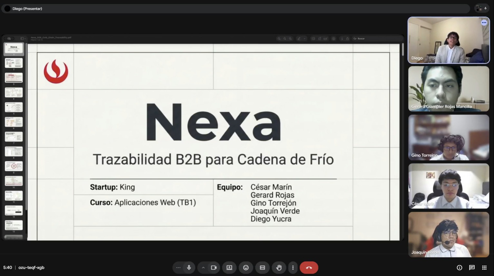

# Annex D: GitHub Repository Evidence

## D.1. Enlaces maestros de repositorios

| Herramienta / Artefacto | Enlace |
|---|---|
| Repositorio GitHub (Reporte) | **upc-pre-202610-1asi0730-12242-king/nexa-ecosystem-report:** [https://github.com/upc-pre-202610-1asi0730-12242-king/nexa-ecosystem-report](https://github.com/upc-pre-202610-1asi0730-12242-king/nexa-ecosystem-report) |
| Repositorio GitHub (Website) | **upc-pre-202610-1asi0730-12242-king/nexa-website:** [https://github.com/upc-pre-202610-1asi0730-12242-king/nexa-website](https://github.com/upc-pre-202610-1asi0730-12242-king/nexa-website) |
| Repositorio GitHub (Web Application) | **upc-pre-202610-1asi0730-12242-king/nexa-webapp:** [https://github.com/upc-pre-202610-1asi0730-12242-king/nexa-webapp](https://github.com/upc-pre-202610-1asi0730-12242-king/nexa-webapp) |
| Repositorio GitHub (Web Services / Backend) | **upc-pre-202610-1asi0730-12242-king/nexa-platform:** [https://github.com/upc-pre-202610-1asi0730-12242-king/nexa-platform](https://github.com/upc-pre-202610-1asi0730-12242-king/nexa-platform) |

## D.2. Releases auditados para AV2

| Artefacto | Enlace |
|---|---|
| `nexa-website v3.0.0` | **https://github.com/upc-pre-202610-1asi0730-12242-king/nexa-website/releases/tag/v3.0.0:** [https://github.com/upc-pre-202610-1asi0730-12242-king/nexa-website/releases/tag/v3.0.0](https://github.com/upc-pre-202610-1asi0730-12242-king/nexa-website/releases/tag/v3.0.0) |
| `nexa-webapp v2.0.0` | **https://github.com/upc-pre-202610-1asi0730-12242-king/nexa-webapp/releases/tag/v2.0.0:** [https://github.com/upc-pre-202610-1asi0730-12242-king/nexa-webapp/releases/tag/v2.0.0](https://github.com/upc-pre-202610-1asi0730-12242-king/nexa-webapp/releases/tag/v2.0.0) |
| `nexa-platform v1.0.0` | **https://github.com/upc-pre-202610-1asi0730-12242-king/nexa-platform/releases/tag/v1.0.0:** [https://github.com/upc-pre-202610-1asi0730-12242-king/nexa-platform/releases/tag/v1.0.0](https://github.com/upc-pre-202610-1asi0730-12242-king/nexa-platform/releases/tag/v1.0.0) |
| `nexa-ecosystem-report v3.0.0` | **https://github.com/upc-pre-202610-1asi0730-12242-king/nexa-ecosystem-report/releases/tag/v3.0.0:** [https://github.com/upc-pre-202610-1asi0730-12242-king/nexa-ecosystem-report/releases/tag/v3.0.0](https://github.com/upc-pre-202610-1asi0730-12242-king/nexa-ecosystem-report/releases/tag/v3.0.0) |

> *Nota:* `nexa-ecosystem-report v3.0.0` consolida el release documental AV2 del informe académico. Los repositorios `nexa-website`, `nexa-platform` y `nexa-webapp` respaldan el ecosistema implementado.

## D.3. Evidencias GitHub AV2

| Evidencia AV2 | Referencia | Ruta sugerida o referencia | Estado |
|---|---|---|---|
| GitHub Release `nexa-ecosystem-report v3.0.0` | Release documental AV2 del informe académico. | `report/assets/images/front-matter/collaboration/report-releases/nexa-ecosystem-report-v3-0-0-release.png` | Incorporado |
| Commits recientes AV2 `nexa-ecosystem-report` | Evidencia de consolidación documental, formato académico, version history, anexos, Sprint 3 y preparación del PDF. | `report/assets/images/front-matter/collaboration/report-commits/nexa-ecosystem-report-commits-av2-recent.png` | Incorporado |
| Branches `nexa-ecosystem-report` | Evidencia de ramas `main` y `develop` para GitFlow documental. | `report/assets/images/front-matter/collaboration/report-branches/nexa-ecosystem-report-branches.png` | Incorporado |
| GitHub Insights AV2 `nexa-ecosystem-report` | Evidencia principal de colaboración del repositorio del informe. | `report/assets/images/front-matter/collaboration/github-insights/nexa-ecosystem-report-insights-av2.png` | Incorporado |
| GitHub Release `nexa-website v3.0.0` | Release de cierre AV2 disponible para revisión. | `report/assets/images/chapter-5/sprint-evidence/releases/nexa-website-v3-0-0-release.png` | Incorporado |
| Branches `nexa-website` | Evidencia de ramas de Landing Page. | `report/assets/images/chapter-5/sprint-evidence/gitflow/nexa-website-branches.png` | Incorporado |
| Commits recientes AV2 `nexa-website` | URL commits: **https://github.com/upc-pre-202610-1asi0730-12242-king/nexa-website/commits/main/:** [https://github.com/upc-pre-202610-1asi0730-12242-king/nexa-website/commits/main/](https://github.com/upc-pre-202610-1asi0730-12242-king/nexa-website/commits/main/) | `report/assets/images/chapter-5/sprint-evidence/collaboration/nexa-website-commits-av2-recent.png` | Incorporado |
| Commits históricos de cierre AV2 `nexa-website` | URL commits: **https://github.com/upc-pre-202610-1asi0730-12242-king/nexa-website/commits/main/:** [https://github.com/upc-pre-202610-1asi0730-12242-king/nexa-website/commits/main/](https://github.com/upc-pre-202610-1asi0730-12242-king/nexa-website/commits/main/) | `report/assets/images/chapter-5/sprint-evidence/collaboration/nexa-website-commits-av2-history.png` | Incorporado |
| GitHub Insights AV2 `nexa-website` | Evidencia complementaria del ecosistema AV2. | `report/assets/images/front-matter/collaboration/github-insights/nexa-website-insights-av2.png` | Incorporado |
| GitHub Release `nexa-platform v1.0.0` | Release de cierre AV2 disponible para revisión. | `report/assets/images/chapter-5/sprint-evidence/releases/nexa-platform-v1-0-0-release.png` | Incorporado |
| Branches `nexa-platform` | Evidencia de ramas de Web Services. | `report/assets/images/chapter-5/sprint-evidence/gitflow/nexa-platform-branches.png` | Incorporado |
| Commits recientes AV2 `nexa-platform` | URL commits: **https://github.com/upc-pre-202610-1asi0730-12242-king/nexa-platform/commits/main/:** [https://github.com/upc-pre-202610-1asi0730-12242-king/nexa-platform/commits/main/](https://github.com/upc-pre-202610-1asi0730-12242-king/nexa-platform/commits/main/) | `report/assets/images/chapter-5/sprint-evidence/collaboration/nexa-platform-commits-av2-recent.png` | Incorporado |
| Commits por bounded context `nexa-platform` | URL commits: **https://github.com/upc-pre-202610-1asi0730-12242-king/nexa-platform/commits/main/:** [https://github.com/upc-pre-202610-1asi0730-12242-king/nexa-platform/commits/main/](https://github.com/upc-pre-202610-1asi0730-12242-king/nexa-platform/commits/main/) | `report/assets/images/chapter-5/sprint-evidence/collaboration/nexa-platform-commits-av2-contexts.png` | Incorporado |
| GitHub Insights AV2 `nexa-platform` | Evidencia complementaria del ecosistema AV2. | `report/assets/images/front-matter/collaboration/github-insights/nexa-platform-insights-av2.png` | Incorporado |
| GitHub Release `nexa-webapp v2.0.0` | Release de cierre AV2 disponible para revisión de Web Application. | `report/assets/images/chapter-5/sprint-evidence/releases/nexa-webapp-v2-0-0-release.png` | Incorporado |
| Commits finales `nexa-webapp` | URL commits: **https://github.com/upc-pre-202610-1asi0730-12242-king/nexa-webapp/commits/main/:** [https://github.com/upc-pre-202610-1asi0730-12242-king/nexa-webapp/commits/main/](https://github.com/upc-pre-202610-1asi0730-12242-king/nexa-webapp/commits/main/) | `report/assets/images/chapter-5/sprint-evidence/collaboration/nexa-webapp-commits-av2-recent-1.png`; `report/assets/images/chapter-5/sprint-evidence/collaboration/nexa-webapp-commits-av2-recent-2.png` | Incorporado |
| Branches `nexa-webapp` | Evidencia de ramas `main` y `develop` de Web Application. | `report/assets/images/chapter-5/sprint-evidence/gitflow/nexa-webapp-branches.png` | Incorporado |
| Insights `nexa-webapp` | Evidencia complementaria del ecosistema AV2. | `report/assets/images/front-matter/collaboration/github-insights/nexa-webapp-insights-av2.png` | Incorporado |

## D.4. Evidencia de coordinación grupal

Este anexo respalda las secciones de colaboración del informe. A continuación, se registran pruebas de coordinación síncrona y asíncrona del equipo, incluyendo capturas de reuniones, revisiones de diseño, acuerdos de trabajo y preparación de entregas.

### Sprint 1

> *Nota:* Figura. Trabajo colaborativo del equipo KING durante el Sprint 1. Elaboración propia.

> *Nota:* Figura. Reunión de coordinación del equipo KING durante Sprint 1. Elaboración propia.

> *Nota:* Figura. Práctica de exposición del equipo KING para la sustentación AV1. Elaboración propia.

### Sprint 2

> *Nota:* Figura. Reunión de coordinación del equipo KING durante Sprint 2. Elaboración propia.

> *Nota:* Figura. Exposición del equipo KING para la sustentación TB1. Elaboración propia.

### Sprint 3

Las evidencias de coordinación Sprint 3 / AV2 y revisión de evidencias AV2 quedan centralizadas en Annex F para evitar duplicidad documental.
